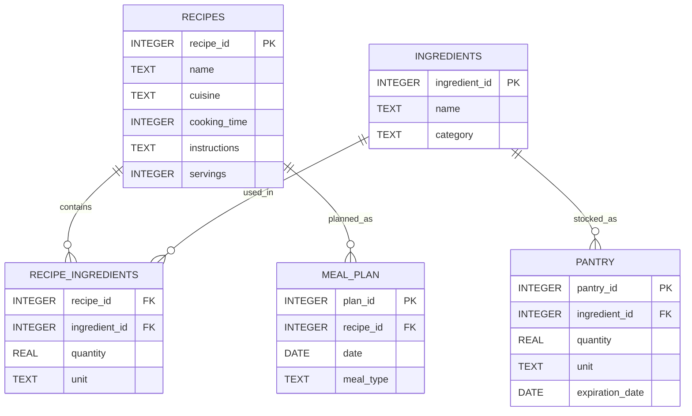

# Project: Recipe & Pantry Management

## Author: MOUAD AIT KHOUYA  
- **GitHub Username:** mouadsifaw  
- **edX Username:** mouaduzumaki2001  
- **Location:** United States, Virginia  
- **Date:** 2/27/2025  

### Video Overview  
[Watch here](https://youtu.be/xka40nfTURQ)  

---

## Scope

The purpose of this database is to streamline meal planning and grocery management for individual users. It enables users to:

- Store recipes
- Manage pantry inventory
- Schedule meals
- Create shopping lists by comparing required ingredients with available stock  

This system aims to reduce the effort involved in organizing meals and ensure efficient ingredient use.

### Included Features:
- **Recipes**: Name, cuisine, cooking time, instructions, and servings.
- **Ingredients**: Name and category (e.g., "vegetable" or "spice").
- **Recipe Ingredients**: Links between recipes and ingredients, including quantities and units.
- **Pantry Stock**: Tracks available ingredients, quantities, units, and expiration dates.
- **Meal Plans**: Schedules recipes for specific dates and meal types (e.g., "dinner").

### Out of Scope:
- User authentication or multi-user functionality (designed for a single user).
- Nutritional information or dietary restriction tracking.
- External integrations (e.g., grocery store APIs or recipe websites).
- Advanced analytics (e.g., recipe usage trends or recommendations).

---

## Functional Requirements

### User Capabilities:
A user should be able to:

- Add, view, and modify recipes, including their ingredients and instructions.
- Manage pantry inventory by adding, updating, or removing ingredients.
- Schedule meals by assigning recipes to specific dates and meal types.
- Generate shopping lists for planned meals by comparing required ingredients with pantry stock.
- Identify recipes that can be prepared using current pantry ingredients.

### Beyond the Scope:
- Sharing recipes or meal plans with others.
- Automatically updating pantry stock after cooking a meal.
- Converting ingredient units (e.g., grams to ounces).
- Tracking nutritional data or creating diet-specific meal plans.

---

## Representation

### Entities
The database includes five key entities:
1. **Recipes**
2. **Ingredients**
3. **Recipe_Ingredients** (junction table)
4. **Pantry**
5. **Meal_Plan**

### Table Structures:

#### Recipes

| Column        | Type      | Constraints |
|--------------|----------|-------------|
| recipe_id    | INTEGER  | Primary Key, AUTOINCREMENT |
| name         | TEXT     | NOT NULL |
| cuisine      | TEXT     |  |
| cooking_time | INTEGER  |  |
| instructions | TEXT     |  |
| servings     | INTEGER  |  |

#### Ingredients

| Column        | Type      | Constraints |
|--------------|----------|-------------|
| ingredient_id | INTEGER  | Primary Key, AUTOINCREMENT |
| name         | TEXT     | NOT NULL |
| category     | TEXT     |  |

#### Recipe_Ingredients

| Column         | Type      | Constraints |
|--------------|----------|-------------|
| recipe_id    | INTEGER  | Foreign Key (Recipes) |
| ingredient_id | INTEGER  | Foreign Key (Ingredients) |
| quantity     | REAL     |  |
| unit         | TEXT     |  |

#### Pantry

| Column         | Type      | Constraints |
|--------------|----------|-------------|
| pantry_id    | INTEGER  | Primary Key, AUTOINCREMENT |
| ingredient_id | INTEGER  | Foreign Key (Ingredients) |
| quantity     | REAL     |  |
| unit         | TEXT     |  |
| expiration_date | DATE  |  |

#### Meal_Plan

| Column         | Type      | Constraints |
|--------------|----------|-------------|
| plan_id      | INTEGER  | Primary Key, AUTOINCREMENT |
| recipe_id    | INTEGER  | Foreign Key (Recipes) |
| date         | DATE     |  |
| meal_type    | TEXT     |  |

### Data Types and Constraints:
- **INTEGER for IDs**: Efficient for indexing and joining tables.
- **TEXT for names and instructions**: Allows flexible text storage.
- **REAL for quantities**: Supports decimal values (e.g., 2.5 liters).
- **DATE for expiration and meal dates**: Standard format for date-related data.

#### Constraints Rationale:
- **Primary Key**: Ensures each record has a unique identifier.
- **Foreign Key**: Maintains referential integrity (e.g., linking pantry items to ingredients).
- **NOT NULL**: Guarantees critical fields like recipe names are always populated.
- **AUTOINCREMENT**: Simplifies ID generation by automatically assigning unique values.

---

## Entity Relationship Diagram (ERD)

---

## Optimizations

### Indexing:
- Indexed `recipe_id` and `ingredient_id` in `Recipe_Ingredients` to accelerate queries for generating shopping lists or checking recipe feasibility.

### Normalization:
- Designed in **Third Normal Form (3NF)** to reduce redundancy (e.g., ingredient names stored only in `Ingredients`).

### Performance Improvements:
- **Optimized queries** for frequent operations like comparing pantry stock with meal plan requirements.

---

## Limitations

### Known Constraints:
- **Unit Consistency**: Users must enter consistent units (e.g., "grams" instead of a mix of "grams" and "cups").
- **Single-User Focus**: No support for multi-user access or role-based permissions.
- **Manual Updates**: Pantry stock does not auto-update when meals are prepared.
- **Scalability**: Performance may decline with large datasets, particularly for complex queries.

### Representation Challenges:
- **Ingredient Substitutions**: No mechanism to store or suggest alternative ingredients.
- **Recipe Variations**: Cannot handle optional ingredients or multiple recipe versions.
- **Dietary Needs**: No fields for allergens, dietary restrictions, or nutritional tracking.

---

This document outlines the structured design of the Recipe & Pantry Management database to ensure efficient and streamlined meal planning.

